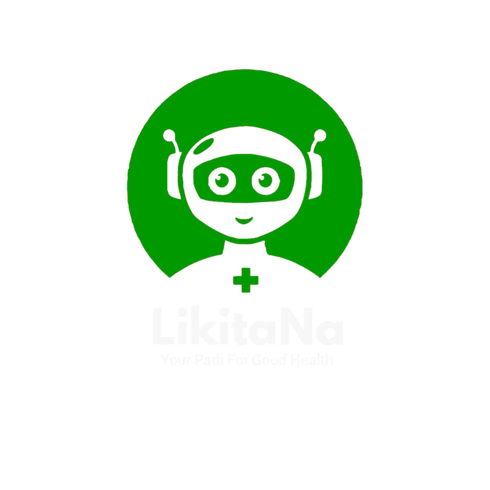

# LikitaNa

**Slogan:** “Your Padi for Good Health.”

## Overview

LikitaNa is an AI‑powered health assistant designed to deliver basic medical guidance, symptom checking, and health education in five Nigerian languages (English, Hausa, Yoruba, Igbo, and Pidgin). Its mission is to empower underserved and rural communities by providing accessible, understandable, and culturally relevant health information, while also connecting users to nearby healthcare services.

## Problem Being Solved

- Limited access to professional healthcare in rural and remote areas  
- Language barriers that limit effective medical consultations  
- Overcrowded clinics due to minor, self-manageable conditions  
- Low levels of health education and awareness in low‑income populations  

## Solution

LikitaNa enables users to describe symptoms in their native language. Using AI and natural language understanding, it:
- Interprets symptoms and suggests relevant medical advice or preventive measures  
- Provides location‑based recommendations to nearby health centers  
- Shares health tips and awareness content based on common conditions  
- Encourages responsible healthcare‑seeking behavior  
- Rewards health education engagement through fun, gamified features  

## Target Audience

- Rural and underserved populations  
- Non‑English speakers  
- Low‑literate users  
- Community health workers  
- NGOs focusing on rural and public health  
- Young, tech‑savvy audiences  

## Technology Stack

- **Frontend**: React (Vite), HTML, CSS  
- **AI/ML**: OpenRouter (GPT‑3.5 Turbo) via OpenAI‑compatible API   
- **Geolocation**: Google Maps API or OpenStreetMap  
- **Hosting**: Vercel for frontend,

## Key Features

1. **Multilingual Symptom Checker** (English, Hausa, Yoruba, Igbo, Pidgin)  
2. **Geolocation‑based Health Center Recommendations**  
3. **Voice & Text Input Options**  
4. **Health Tips & Awareness Content**  
5. **Gamification** (Badges, Learning Milestones)  
6. **Clean, Accessible, Green‑Themed UI**  
7. **AI‑powered Conversation Simulation**  
8. **Offline‑Ready Architecture** (PWA)  
9. **User‑friendly, Low‑tech Interface**  

## 📸 Screenshot

  
*Figure: LikitaNa chatbot  logo.*

## ⚙️ Installation & Setup

1. **Clone the repo**  
   ```bash
   git clone https://github.com/akolobulus/LikitaNa_1.git
   cd LikitaNa_1
   ```

2. **Frontend**  
   ```bash
   cd frontend
   npm install
   # create .env with:
   # VITE_OPENROUTER_API_KEY=sk-your-key-here
   npm run dev
   ```

3. **(Optional) Backend**  
   ```bash
   cd backend
   npm install
   # create .env with:
   # OPENROUTER_API_KEY=sk-your-key-here
   npm start
   ```

4. **Open** `http://localhost:3000` in your browser.

## 📜 License

Distributed under the MIT License. See `LICENSE` for details.

## 🙏 Acknowledgments

- **3MTT Nigeria** for supporting this project and the Learning Community.  
- OpenRouter / OpenAI for powering the AI assistant.  

## 👨‍💻 Developer

- **Name**: AKolo Bulus  
- **GitHub**: [akolobulus](https://github.com/akolobulus)  
- **LinkedIn**: [AKolo Bulus](https://linkedin.com/in/akolo-bulus)  
